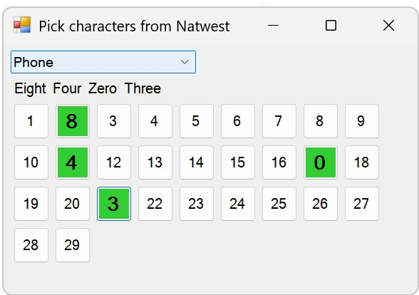

# Pick-Chars-Plus

**Pick-Chars-Plus** is a lightweight [KeePass](http://keepass.info/) plugin that integrates into KeePass’s entry context menu and allows users to quickly view specific characters from an entry’s protected string fields. It supports the **Password** field as well as **Advanced String** fields.

The plugin provides functionality similar to the built-in [PICKCHARS placeholder](https://keepass.info/help/base/placeholders.html#pickchars), but instead of inserting characters into another field, it simply displays the character at the requested position for easy reference. This is especially useful when a website or phone-based security check asks for specific characters from your password (characters are also shown using phonetics).

If you’ve ever had to count along a password to work out the 5th and 9th characters, this plugin removes the guesswork.

---

## Installation

[Download the latest release](https://github.com/mar71n/KeePass-Pick-Chars-Plus/releases)

1. Ensure you are using **KeePass 2.x**
2. Copy `PickCharsPlus.dll` into the KeePass Plugin installation directory (where `KeePass.exe` is located)
3. Restart KeePass to load the plugin

---

## Setup

1. Just set your password as normal
2. Add any values you want to the standard - Password Entry > Advanced > String Fields tab. 

You might use the 2nd option when a service asks you to log your Best Freinds surname, First Car Reg and then later ask for random characters from these at login.

---

## Usage

1a. Right-click an entry to open its context menu.
1b. |OR| In the Password Entry Dialogue, click the **TOOLS** button.
2. Click **Pick Chars Plus+** menu item 
3. In the window that appears, select the secure string you want to use (Password or one of your Advanced String fields)
4. Click the button(s) corresponding to the character positions you need.
5. Read off the character or see the phonetics shown.

   

6. When finished, close the window or press **ESC**

## Changelog

v1.1 - Adds the Menu item to the Entry TOOLS button.